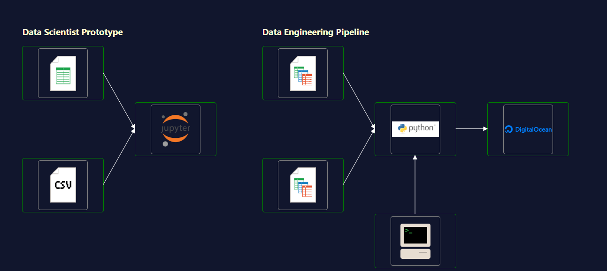

Data enineers are effectively librians for data their primary focus is ensuring that data and resources needed are catalogued and accesible.

This could be organised in a database or a business intelligence tool.

Types of tools that can be used for this include Python with dedicated libraries (e.g. pandas) and SQL (example python library - sqlite3).

SQL is a dedicated language for working with databases. Programs written in SQL are called queries as they are typically used to ask for information from databases but SQL can also be used to create new tables or restructure existing tables.

## Data Engineer vs Data Scientist Role
Data engineers are not data scientists but they work closely together.

Data scientists create the models and analyses and the data engineers work on the deployment and automation of the data pipeline.

The data pipeline is important as it
* Regularly updates the data
* Tests for and logs any errors
* Loads the output to a cloud database or business intelligence tool

Jupyter notebooks are really useful as the are borwser based and allow datascientists to quickly prototype analytics and visualisations. At this stage the data scientist may use a snapshot of a live database to prototype. The data engineer will then make sure the deployed pipeline uses the live data by accessing the live data databse.

Once the notebook is where it nees to be it can be converted to a python script that be run automatically outside of the notebook.

When doing this it is prudent to add unit tests to ensure the notebook is working correctly and to log errors if not.